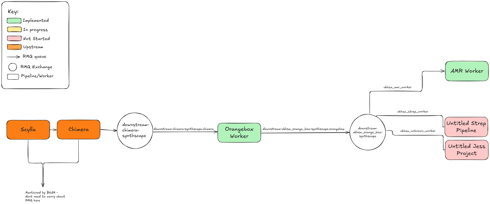

Document to be updated as I configure rabbitmq exchanges - with names and queues. Currently shows synthscape deployment

## Permissions

RMQ permissions are configured like so:

configure -> 
`downstream-ukhsa_\w*-synthscape|inbound-new_artifact(_rerun)?-synthscape\.ukhsa_\w*|downstream-\w*-synthscape\.ukhsa_\w*`

write ->
`downstream-ukhsa_\w*-synthscape`

read -> 
`inbound-new_artifact(_rerun)?-synthscape|downstream-\w*-synthscape`

## Overview
Diagram of current progress

## Bham managed exhanges (that are relevant)

## `downstream-chimera-synthscape`

This is an exchange that `chimera` publishes to. The orange box listens to this.

## GPHA managed exchanges

## `downstream-ukhsa_orange_box-synthscape`

This is a fanout exchange that the orange box pipeline publishes to, once a sample has completed that pipeline. All workers will be bound to queues on this exchange, so that each worker will be aware of when a sample completes the orange box.

#### Queues
###### `ukhsa_amr_worker`
Worker queue for the AMR pipeline